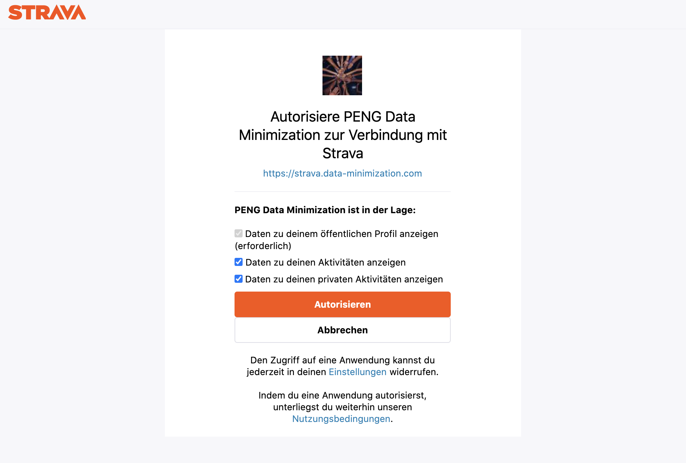
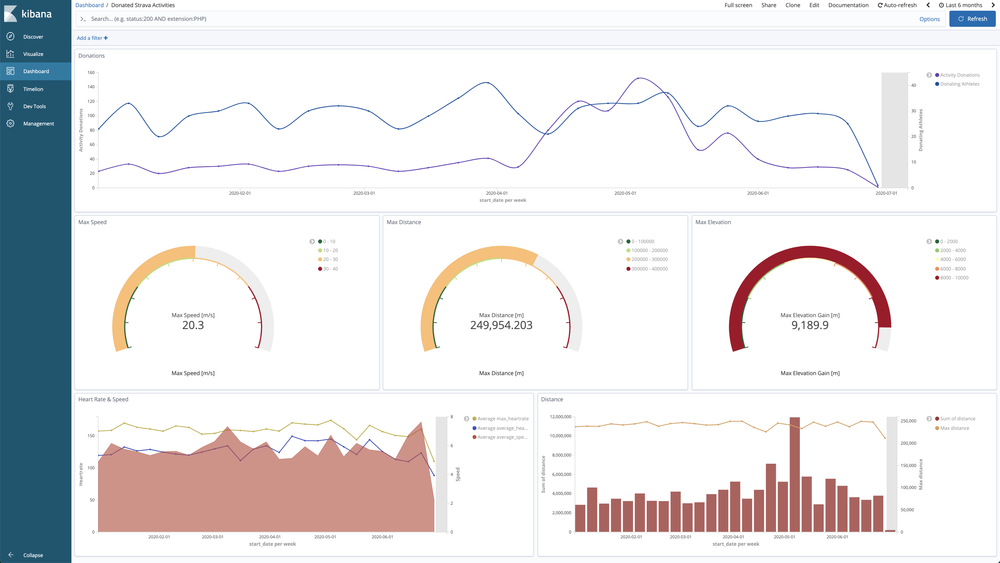

# Fitness Data Pipeline

A Kubernetes based fitness data streaming pipeline with the following components:
* Confluent Platform
* Elasticsearch & Kibana
* Grafana & Prometheus
* Data Minimization SPI worker
* Fitness Data Donation Platform
* Fitness Data Kafka Producer

## Usage

1. Donate fitness data (e.g. Strava activities)
2. Apply data minimization methods on streamed fitness data
3. Visualize anonymized or aggregated data in Kibana
<table><tr>
    <td>  </td>
    <td>  </td>
</tr></table>


## Dependencies

* helm
* kubectl
* envsubst (gettext)


## Deployment

1. Deploy the data minimization pipeline based on Confluent Kafka with Elasticsearch and Kibana for visualizations and Prometheus and Grafana for monitoring (for configuration options and a deployment guide please refer to [pipeline/README.md](pipeline/README.md)):
    ```
    $ helm repo add dm-helm-charts https://peng-data-minimization.github.io/helm-charts
    $ helm install dm-pipeline dm-helm-charts/data-minimization-pipeline
    ```

2. Create a k8s deployment for the donation-platform and the kafka-producer and expose them via a LoadBalancer:
    ```
    $ export STRAVA_CLIENT_ID=<client-id>
    $ export STRAVA_CLIENT_SECRET=<client-secret>
    $ export PIPELINE_CP_PREFIX=<helm-confluent-platform-release-name> # needed to reach the Kafka broker
    $ cat deployment.yml | envsubst | kubectl apply -f -
    ```

3. Configure the [SPI](https://github.com/peng-data-minimization/kafka-spi) with the [data minimization worker](https://github.com/peng-data-minimization/minimizer) for the fitness data use case
    ```
    $ helm upgrade dm-pipeline dm-helm-charts/data-minimization-pipeline --reuse-values -f pipeline/spi/fitness-data-minimization-tasks.yml
    ```

4. Test the pipeline (see [Manual Testing](#manual-testing))


## Development

Build images and push them to DockerHub:
```
$ ./publish-image.sh
```

Roll out the new images with k8s:
```
 $ kubectl rollout restart deployment/kafka-fitness-data-producer
```
### E2E Pipeline & Performance Testing

* run `./pipeline/bin/test-pipeline.sh` to execute the manual steps below and test the complete pipeline end-to-end
* run `./pipeline/bin/performance-test-kafka.sh` to deploy a Kafka client pod and execute performance tests for the Kafka broker

Refer to [pipeline/README.md](pipeline/README.md) for more details.

### Manual Testing

**Kafka Producer**

Start continuously sending generated fitness data to Kafka:
```
$ kubectl port-forward deployment/kafka-fitness-data-producer 7778
$ curl -s -X GET http://localhost:7778/generate-data/start
```

**Fitness Data Donation Platform**

Get  to access the donation platform and donate e.g. Strava activity data:
```
$ kubectl port-forward deployment/kafka-fitness-data-producer 7777
$ open http://localhost:7777/authorize/strava
```
Alternatively, get the external loadbalancer ip with `kubectl get services fitness-data-donation-service  --output jsonpath='{.status.loadBalancer.ingress[0].ip}'`.

**Kafka Broker**

Send data via:
* donation platform `/authorize/{strava,garmin}`
* fitness data kafka-producer `/generate-data/start`
* manually
    ```
    kubectl exec -c cp-kafka-broker -it dm-pipeline-cp-kafka-0 -- /bin/bash /usr/bin/kafka-console-producer --broker-list localhost:9092 --topic anon
    ```

Verify that data can be consumed:
```
$ kubectl exec -c cp-kafka-broker -it dm-pipeline-cp-kafka-0 -- /bin/bash /usr/bin/kafka-console-consumer --bootstrap-server localhost:9092 --topic anon --from-beginning
```

**Kafka / Zookeeper Client Deployment**

Deploy Kafka or Zookeeper client pod to play around:
```
$ cd /data/workspace/
$ git clone https://github.com/confluentinc/cp-helm-charts.git
$ kubectl apply -f cp-helm-charts/examples/kafka-client.yaml
$ kubectl exec -it kafka-client -- /bin/bash <kafka-binary>
```
For more details see [cp-helm-charts#kafka](https://github.com/confluentinc/cp-helm-charts#kafka) and [cp-helm-charts#zookeepers](https://github.com/confluentinc/cp-helm-charts#zookeepers).


### Local Setup

To build and test the application locally, use docker-compose:
```
$ docker-compose up --build
$ open http://localhost:7777 # testing fitness-data-donation-platform
$ curl -X GET http://localhost:7778/generate-data/start # testing kafka-producer
$ docker exec $(docker ps -aqf "name=fitness-data-pipeline_kafka_1") /bin/bash -c "/opt/kafka_*/bin/kafka-console-consumer.sh --bootstrap-server kafka:9092 --topic anon --from-beginning" # verify that messages have arrived
```

See [kafka-producer/README.md](kafka-producer/README.md) and [donation-platform/README.md](donation-platform/README.md) for more details.
