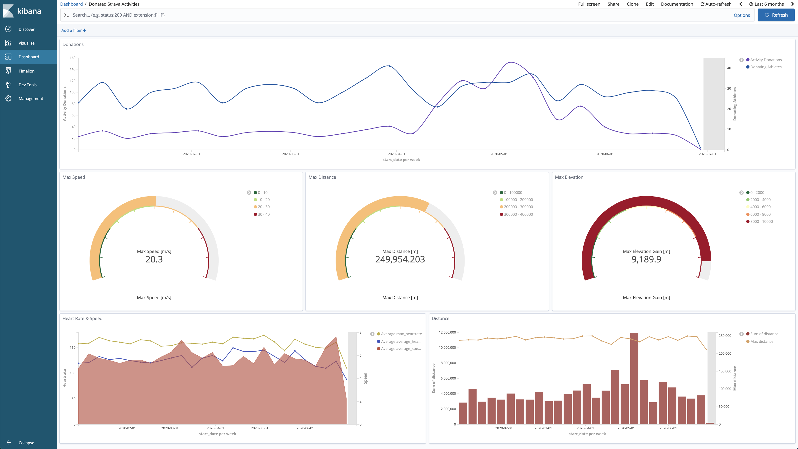

# Streaming Pipeline

A Kubernetes based data minimization streaming pipeline with the following components:
* Confluent Platform
* Elasticsearch & Kibana
* Grafana & Prometheus
* Data Minimization SPI worker


## Setup Data Minimization Pipeline

Deploy the complete data minimization pipeline with the SPI worker, a Confluent Kafka stack, Elasticsearch, Kibana for visualizations and Prometheus and Grafana for monitoring:
```
$ helm repo add dm-helm-charts https://peng-data-minimization.github.io/helm-charts
$ helm install dm-pipeline dm-helm-charts/data-minimization-pipeline -f pipeline/spi/fitness-data-minimization-tasks.yml -f pipeline/kibana/visualizations.yml
```
where:
* `fitness-data-minimization-tasks.yml` is the [SPI](https://github.com/peng-data-minimization/kafka-spi) worker config containing all data minimization tasks (refer to the [minimizer repo](https://github.com/peng-data-minimization/minimizer) for more task configuration options)
* `visualizations.yml` is a Kibana config importing pre-defined fitness data visualizations and dashboads

In case you would like to name the pipeline differently, keep in mind that release name specific entries of the default `values.yaml` have to be updated.


## Test Pipeline
**`Producer -> Broker -> Connector Sink -> Elasticsearch -> Kibana`**

### Scripted E2E & Load Testing
* run `./pipeline/bin/test-pipeline.sh` to execute the manual steps below and test the complete pipeline end-to-end
* run `./pipeline/bin/performance-test-kafka.sh` to deploy a Kafka client pod and execute performance tests for the Kafka broker

### Manual Testing
1. Generate test activity data
    ```
    # kafka-fitness-data-producer deployment required
    $ kubectl port-forward deployment/kafka-fitness-data-producer 7778
    $ curl -X GET http://localhost:7778/generate-data/start

    # altervatively manually generate data
    $ kubectl exec -c cp-kafka-broker -it dm-pipeline-cp-kafka-0 -- /bin/bash /usr/bin/kafka-console-producer --broker-list localhost:9092 --topic anon
    ```
2. Check that data can be consumed
    ```
    $ kubecexec -c cp-kafka-broker -it dm-pipeline-cp-kafka-0 -- /bin/bash /usr/bin/kafka-console-consumer --bootstrap-server localhost:9092 --topic anon
    ```
3. Check that Elasticsearch connector sink works
    ```
    $ kubectl logs elasticsink-0 -f | grep "Delivered"
    [2020-06-29 09:37:03,969] INFO Delivered 90 records for anon since 2020-06-29 09:32:27 (com.datamountaineer.streamreactor.connect.utils.ProgressCounter)
    ```
4. Query Elasticsearch
    ```
    $ kubectl port-forward service/elasticsearch-client 9200
    $ curl -X GET http://localhost:9200/activities/_search?size=10\&q=*:* | jq .[]
    ```
5. Check Kibana
    ```
    $ kubectl port-forward deployment/kibana 5601
    ```

### Monitoring

Open Grafana locally and check pre-defined K8s dashboard
```
$ kubectl get secret dm-pipeline-grafana -o jsonpath="{.data.admin-user}" | base64 --decode
$ kubectl get secret dm-pipeline-grafana -o jsonpath="{.data.admin-password}" | base64 --decode
$ kubectl port-forward deployment/dm-pipeline-grafana 3000
```

---
**DEPRECATION WARNING**

*Previously, all pipeline components were setup independently (see sections marked as DEPRECATED below). This still works, but is not the recommended setup.*

*Now, all components are packaged in a single helm chart and can be deployed with a single command.*

---

## Setup Confluent Platform (DEPRECATED)

Deploy the Confluent Platform with helm:
```
$ helm repo add confluentinc https://confluentinc.github.io/cp-helm-charts/
$ helm install dm-pipeline confluentinc/cp-helm-charts --version 0.5.0 -f pipeline/confluent-platform/values.yml
```

If you are having problems with access your kafka brokers from the outside, have a look [here](https://medium.com/@tsuyoshiushio/configuring-kafka-on-kubernetes-makes-available-from-an-external-client-with-helm-96e9308ee9f4) and [here](https://github.com/confluentinc/cp-helm-charts/issues/351).


## Setup Elasticsearch & Kibana (DEPRECATED)

For reference see the following tutorials [1](https://www.linode.com/docs/kubernetes/how-to-deploy-the-elastic-stack-on-kubernetes/
) & [2](https://logz.io/blog/deploying-the-elk-stack-on-kubernetes-with-helm/).

Warning: Unfortunately, the lensesio Kafka Elasticsearch connector does not yet support Elasticsearch 7 and the elastic/elasticsearch helm repo does not support a compatible Elasticsearch 6.x version. Therefore, the deprecated stable/elasticsearch helm chart with version 1.32.2 (Elasticsearch 6.8.2) is used instead. To prevent compatibility issues with Kibana an old version is used as well.

1. Deploy Kafka Elasticsearch connector
    ```
    $ helm repo add landoop https://lensesio.github.io/kafka-helm-charts
    $ helm install elasticsink landoop/kafka-connect-elastic6-sink -f pipeline/kafka-connect-elastic-sink/values.yml
    ```

2. Deploy Elasticsearch:
    ```
    $ helm repo add stable https://kubernetes-charts.storage.googleapis.com/
    $ helm install elasticsearch stable/elasticsearch --version 1.32.2 -f pipeline/elastic/values.yml
    ```

3. Deploy Kibana:
    ```
    $ helm upgrade kibana stable/kibana --version 3.2.6 --set env.ELASTICSEARCH_HOSTS=http://elasticsearch-client:9200
    ```

4. Configure Kibana
    * Enable port forwarding to access the web app
        ```
        $ kubectl port-forward deployment/kibana 5601
        ```
    * Create index pattern for index `activities`
    * Import dashboard and visualizations (see [dashboard.json](pipeline/kibana/config/dashboard.json))
        

5. Test Stack (see [Test Pipeline](#test-pipeline))


## Setup Monitoring (Grafana & Prometheus) (DEPRECATED)

JMX Metrics are enabled by default for all Confluent Platform components, Prometheus JMX Exporter is installed as a sidecar container along with all Pods.

1. Install Prometheus and Grafana in same Kubernetes cluster using helm:
    ```
    $ helm install stable/prometheus
    $ helm install stable/grafana

    # Alternatively:
    $ helm install my-prometheus-operator stable/prometheus-operator
    ```

2. Login to Grafana (username: `admin`)
    ```
    $ kubectl port-forward svc/grafana 80
    $ kubectl get secret grafana -o jsonpath="{.data.admin-password}" | base64 --decode
    ```

3. Add Prometheus as Data Source in Grafana (http://prometheus-server:80)

4. Import Confluent dashboard into Grafana ([confluent-grafana-dashboard.json](monitoring/confluent-grafana-dashboard.json))
